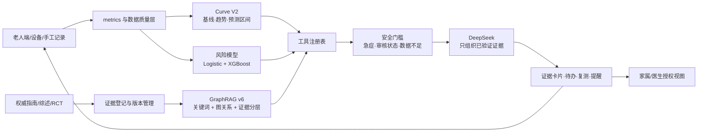

# 系统架构图（汇报版）

```mermaid
flowchart LR
  A[老人端/设备/手工记录] --> B[metrics 与数据质量层]
  B --> C[Curve V2\n基线·趋势·预测区间]
  B --> D[风险模型\nLogistic + XGBoost]
  E[权威指南/综述/RCT] --> F[证据登记与版本管理]
  F --> G[GraphRAG v6\n关键词 + 图关系 + 证据分层]
  C --> H[工具注册表]
  D --> H
  G --> H
  H --> I[安全门槛\n急症·审核状态·数据不足]
  I --> J[DeepSeek\n只组织已验证证据]
  J --> K[证据卡片·待办·复测·提醒]
  K --> A
  K --> L[家属/医生授权视图]
```

核心原则：模型负责估计，GraphRAG 负责证据和关系，安全门槛先于大模型，DeepSeek 不能创造指标、日期、概率或药物剂量。
